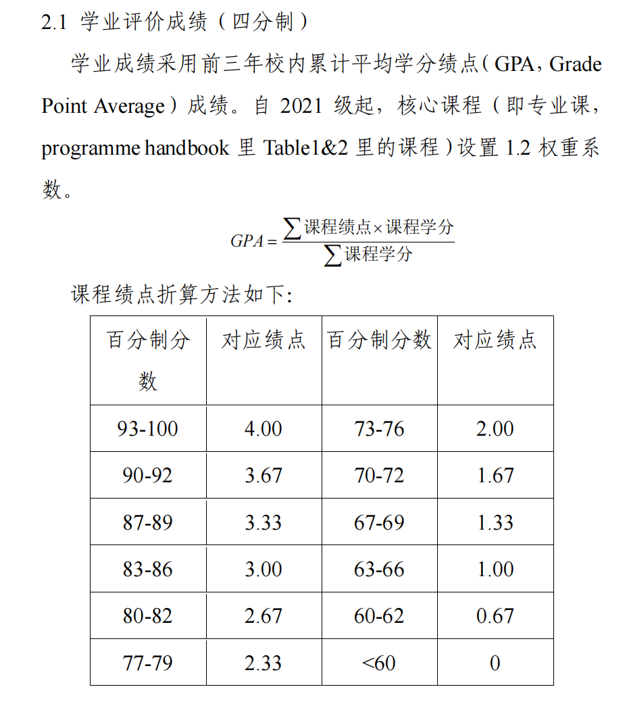

# 推免相关

## ZJUI推免相关

### 推免比例

推免比例大概为28%，每年不一样。

### 难度

往年难度很低，基本最后一个报名的也能录上。但是今年开始，排名靠前的同学中只有少数选择出国，所以基本也就是按照纯绩点排名，在28%以后再往后数几名。

### 时间线

我们当时是大三结束后的9月份预推免，9月25日接受拟录取，夏令营在5月至8月。据说今年开始是7月份开始预推免，所以夏令营等时间都可能会提前。具体的套瓷、比赛和科研论文需要自己把控时间，结果尽量在6月前出来。

### 计算方式

名额不是按照正常绩点排名计算的，而是专业课乘以1.2的系数后，再跟其他课程加起来计算推免绩点，不过排名几乎不会变。另外，还有一些竞赛、论文和社会工作方面的加分，会直接加到绩点上再进行排名。这些加分大部分学生都很少，所以还是要尽量保证绩点在前面，不要试图依靠加分来获得名额。

### 注意的点

尽量在大一、大二时就要有选择以后研究方向的意识，选择自己喜欢的方向是很重要的。很多同学只利用假期时间随意挑选学院给出的课题，导致不能长期坚持、没有自驱力，而且到头来做的课题方向还很混乱。尽量提前想清楚，然后主动寻找日常实习，提前积累一些相关经历。

不要一味地三分钟热度，盲目参加竞赛，还是要根据自己的专业兴趣参加适合的比赛。如果想进行推免，还是要把注意力放在绩点和科研上。

> @Zibo

## ZJE推免相关

### 推免的定义

推免，即“推荐免试”研究生（俗称保研），是我国多元研究生招生体系中的关键一环。具体流程上，ZJE将在每年9月，综合学生的推免绩点、科研竞赛及社会工作等加分项，审定并公布最终的推荐名单。在此之前，申请者须于夏令营或预推免阶段自主获得目标院校的拟录取资格，方能最终完成保送流程

### 推免比例

推免比例大概为该专业人数的30%左右，每年受到学校各学院从上到下分配的影响

### 推免名额获取方式

基本要求：思想品德合格，无违法乱纪和其他违规、

绩点计算：

{width=65%}

此外还有各类论文，竞赛，志愿者学生干部加分（这两个比较少）详见细则

### ZJE近年推免情况

2022级学生中，BMS到约38名（88人），BMI较多约60%，近年成绩前段出国的人数整体减少，竞争可能会略加激烈，但每年随机变数很大

### 推免时间线

大三9月及之前——确定保研目标，搜集讯息，努力完成科研项目、提升绩点大三3月——提前和各导师争取推荐信大三4月——报名北大生科院夏令营（4月截止）提前准备好各种材料后可用大三5月——密切关注夏令营讯息（保研＋公众号，小红书等渠道）认真考试大三6月——继续报名，准备夏令营所用PPT、知识等大四6-9月——夏令营、预推免面试季推荐信要准备3个教授的（固定格式/亲笔签名）部分院校允许电子签名

注意：近年来夏令营不办，直接预推免或无效力的趋势，**一切以当年信息为准**

### 夏令营的经验和技巧

#### （一）入营

老师筛选入营主要看以下内容：

- **学校背景**
- **绩点排名**
- **科研经历和论文**（完整的经历；很水、错误很多的论文会是减分项）
- **语言成绩**（如六级、托福、雅思）
- **个人陈述**（不宜夸张，正常严谨表述即可）

尽可能在材料中展现出你比其他同学更有优势的地方。

#### 套磁（导师联系）

- **时机**：入营之后、夏令营开始前一周以上为最佳（未入营时导师可能不会重视）。
- **内容**：个人简历、对研究方向的兴趣和理解、未来想做什么。
- **Tips**：
    - 最好选在周一、周二上午工作时间发邮件；
    - 不要海投！

#### （三）面试环节（常见形式举例）

**1. 纯个人展示**

流程：英文文献翻译（5分钟） + 个人介绍（10分钟） + 专家提问（15分钟）

个人介绍应包含：个人信息、科研经历和成果

对策：落落大方，不怯场不轻浮；充分发挥英文优势进行翻译；选择性展示较为完整、说得明白的科研经历；仔细了解自己提及的专业知识和技术细节；遭遇压力面保持淡定，虚心求教。

**2. 半结构化面试**

流程：自我介绍（2分钟） + 多对多面试（专业类+生活类问题）

对策：类比海宁入学的面试，有些问题不太清楚可以第二或第三个答，为前面同学做补充；放松心情，微笑回答；回答可与其他同学呼应；不要自我贬低。

**3. 笔试加测试加面试**

流程：笔试（英文SAQ） + 现场文献阅读（1小时） + 回答文献内容及简单提问

考核维度：笔试成绩、文献理解能力（提供电脑，不可用AI）、个人面试表现

策略：SAQ尽力而为，适当复习；文献难度适中，控制好时间，认真把握全文内容，有空可搜索技术细节；端正英语发音，可能会要求朗读部分内容。

#### （四）确认环节

- 夏令营结束后 **1–7天内** 会确认优秀营员（通过现场、电话、邮件通知）。
- 要求在 **3–20日内** 确认或放弃，**及时回复，过期不候**（尽可能早回复）。
- 部分项目要求优营签署**保证书**，请仔细思考后再做决定。
- 注意：部分夏令营拿到优营后，还需参加**预推免复试**（8月底–9月）。

### 四、语重心长的建议

#### 1. 保持信息畅通，随机应变

及时关注《保研＋》等公众号和学校官网；

千万不要错过开营信息，不要错过后续填报（可能只有24小时时间）；

每年政策都会有调整，及时确认电话、短信和邮箱。

#### 2. 想得开，挺得住

保研过程中难免遭遇失败、焦虑、恐惧；

不要因一次挫败和变故而绝望，但也别把保研看作生活的一切；

尽力而为，做好该做的，然后好好放松，静待花开。

#### 3. 问心无愧，做出属于你的选择

面对多个Offer，基于**导师成果、性格、工作模式、学院氛围、待遇和毕业去向**，选出最心仪的；

倘若推免失败，也请不要沮丧——请相信在ZJE的你，无论在哪都会有光明的未来；

> @bwb