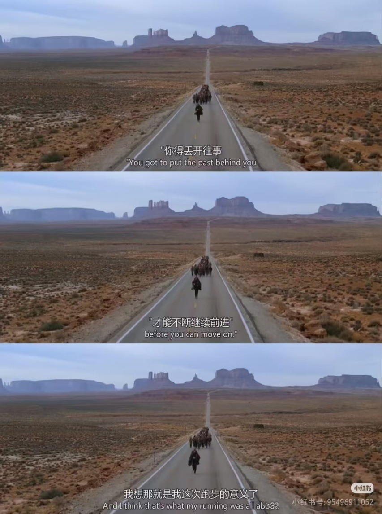

# 学长学姐经验分享

> 以下内容为不同年级学生的个人经验，不代表学院规定；涉及课程要求、学术诚信和升学政策时，请以当年官方要求为准。

## 经验分享 1

正好我最近在申请国外的大学，给大家分享一下我的一些经验，希望可以给接下来想要出国发展的同学一些参考。

第一，不要把GPA当成大学的全部，但一定要把GPA保住。我觉得GPA更像是一张门票。申请国外学校、暑研、奖学金的时候，它不会让你脱颖而出，但如果太低，会直接失去很多机会。所以尽量把基础课学扎实，保持一个不错的成绩，后面才能放心去探索科研、竞赛或者实习。

第二，越早接触科研越好，但不要为了发论文而科研。我很幸运有一个学长给我指了这条路，所以我也想分享给大家。如果你对科研有兴趣，想要以后出国深造，并且有一定的能力和精力，那么越早接触科研越好。尤其是在海宁，我们可以很方便地联系到教授，并且教授们也很愿意给本科生提供科研机会，我觉得这算是我们校区的一个优势。大家不要惧怕大一科研这件事，它不需要我们对这个领域很精通，更多的是由教授和师兄带我们入门。当然，也不能小看科研，刚开始可能几个月没有结果，一个模型反复失败，一篇论文读一周都读不懂，这都很正常。

本科阶段最重要的其实不是论文数量，而是自己要好好想想自己想做什么领域，然后学会怎么读论文、怎么提出问题、怎么做实验、怎么和导师沟通。最重要的是把自己的taste建立起来，这些经验和能力都比一篇论文本身更重要。

第三，多主动发邮件、多主动联系老师、多去和老师建立connection。国外老师每天都会收到很多邮件，你的一封邮件不会打扰别人。无论是申请RA、暑研，还是问问题，无论这个老师是大咖还是rising star，只要邮件认真、有礼貌，就大胆发，万一你就搭上了这根线呢。有了connection之后，科研、论文和申请都会相对容易一点。在UIUC的一位师兄跟我说，实验室更喜欢招一个他们熟悉、了解的人，而不是一个看着绩点非常高、科研经历也很完美的人。

最后，对于申请这件事，我认为重要程度由高到低是connection > 科研经历 > pub > 标化成绩。我的想法可能和大家原本的认知有一些出入。希望我的这些经验能帮到大家，也希望大家以后的学习生活更加顺利。

> [Resurgam.](https://resurgamm.github.io/)，写于2026年7月14日，UIUC [Rehg Lab](https://rehg.org/)

## 经验分享 2

1. 请学会正确使用AI/agent，但不要滥用。（老师，我的豆包给我报了清华大学，我怎么来这里上学了？）
2. 要有正确辨别信息的能力，学会使用浏览器。
3. 学校的课程永远只会带你在所有方向入个门，具体的深入都得靠你自己。
4. 当你开始做科研，被互联网上各种夸张的本科生信息震撼时，不要浮躁，做好自己，大不了gap一年（更何况其实读个MS相对没那么难，指和直博相比）。
5. 你可以做科研，前提是绩点别炸了。二者要找平衡，优先顾好课内。
6. 大学生活很精彩、很多元，不是所有人都只有做科研一条出路。能把爱好做好也很好，实习做好也很牛，不要当个做题家。
7. 人不是只能当二极管，人是有灰度的。
8. 你从学长学姐那里得到的经验不一定绝对正确，或者说不一定适合每一个人。这个整合的过程必须由你自己完成，才是最适合你的。这也是大学和高中最大的区别。不要全盘接受这帮老东西/学长学姐直接给你的经验，这些经验不一定绝对正确，只是他们在当时的环境下觉得正确。你需要有自己的思考和判断。如果你在这个阶段仍然有问题，那或许这帮老东西能给你一些更有用的建议。
9. 祝你玩得愉快。

> [齐康](https://zhangjiayi24.github.io/)，写于2026年7月11日，清华大学交叉信息研究院（IIIS）[XuLab](https://www.mengdixu.me/)

## 经验分享 3

1. 一定要学会 **正确** 地使用AI以及Agent，需要有对课程/作业必要性的判断，即如果该作业你认为对你的知识掌握没有帮助，那么不要花费任何多余的时间在上面，直接丢给AI搞定就行；如果你认为教授讲的课是一坨（实际上大学里大部分教授面向本科生的授课都是一坨），那么到youtube甚至b站上找课去听，PPT研究明白，mock test研究明白，一样可以有好的分数。
2. 尽早开始思考自己的去向，如果出国应该往什么方向努力，如果保研应该往什么方向努力，什么学校的bar有多高，这些都不是老师直接告诉你的，无论是通过学长学姐还是自己联系实验室，都需要为自己的深造生涯做充足的准备。
3. 引用自南京大学某论坛：绩点就像牛子的长短，你可以因为绩点高而骄傲，但是你不能逢人就说你的绩点很高。一定要意识到每个人和周围的同学本质上是竞争关系，你也无法保证你身边的人没有一个有坏心思，产生恶性竞争的本质是资源有限+评价标准单一，当保研名额就那么多，所有人又按照同一个GPA公式排名时，关系自然而然就会变质。
4. 锻炼身体，谈一次恋爱或者深度维护一段亲密关系，学会无聊
5. 不公平是必然的，有人天生比你擅长某些事情，有人家里的关系就是会让你感到“误闯天家”，这个时候愤怒和嫉妒没有任何用，能做的只有在规则内最大化自己的收益，和昨天的自己比而不是和任何其他人比，因为每个人的牌不一样，比了只会内耗。
6. 尽早建立输出的习惯。大学最容易陷入的误区就是“只输入不输出”——听课、看书、刷题，但是不生产任何东西。无论是写技术博客，做项目，发论文，甚至只是整理课堂笔记分享到github，这些输出才是未来的硬通货。

总的而言，我个人认为在大学本科生活（甚至到后面的硕士和博士阶段），我们的目标不应该是“做一个好学生”，而是应该“用最小的成本，拿到最大的筹码，去你想去的地方，过你想过的生活”

> Anthony，写于2026年7月15日，EE Sophomore

## 经验分享 4

### ZJE使用报告——来自一个ZJE老资历的小建议

#### 前言

年轻人们你们好！感谢你们选择美丽的海宁国际校区和ZJE，想必对即将开始的大学生活有不少期待和疑问，在这里老资历学长将为你们一一解答，希望有所帮助（^^）!

自我介绍：bwb 22级BMS本科生 浙江杭州人 绩点科研学生活动均中上 毕业去向：清华TIMBR项目

#### 学习部分评价

**培养概括：**ZJE会让你学习到**科研所需的几乎所有基本功**：阅读英文文献，演讲，分析报告，做实验，写论文，小组讨论和构思科研项目等，在后续深造科研中很有优势

**主要难点和对策：**

**1：英文授课**

刚开始确实有点费力，认真上ioe网课，多说多听多读外文内容会适应的

（没事，学长我到毕设答辩的时候也听不懂几个老师特别的口音）

核心是认真听，尝试去理解，不出大半个学期会有长进的，一开始内容也不难

**2：课程内容**

ZJE的具体授课内容比较零散（如大二BAO,IFBS等课程），并不是很好消化，遇到问题可以**积极询问老师**，也可以**请教朋友**，也可以参考学长学姐搭建的网站

<https://chenyiru3.github.io/My_Notes_Four_ZJE>

**3：高强度期末月！**

课程论文作业和期末考试总是在期末周一块来，**尤其在大二下的时候， IFBS挂科率极高（这门十学分大课补考不通过就会留级）**，要（1）每周整理课程内容防止期末来不及 （2）积极参加会给例题练习讲解的讨论课 （3）充分**了解答题要求**，有些不希望你们像高考简答题一样按点给分

**4：有限的指引**

ZJE的很多课程信息，学生事务和提醒会分别出现在微信群，钉钉，blackboard和outlook邮箱等途径，建议同学们**勤加查看，互通有无，积极询问**

**（真的有大问题教务老师会打电话提醒的，但最好别）**

#### 生涯规划和学习方法部分

1：生物相关内容不能死记硬背，不梳理理解做不出题目，但**关键的那几个名词要记牢写得出来！！**

2：善用ai工具辅助学习理解，提供建议，但请不要用来直接代替你，ai也会出错记得检查

3：鼓励大家在**不搞砸课业的情况**下积极参与科研（大一下或者大一暑假开始），不求论文发表，但要做出**独立的完整的科研故事（**提出了什么问题，用了什么操作发现了什么，证明了什么**）**

4：不必刚进来就定死自己想要保研，出国或者做什么，在大一和大二前半段多多练好英语和基本功，维持GPA，多接触不同的领域和不同的学校，慢慢明晰自己的方向

5：条条大路通罗马，**来ZJE只要不完全摆烂，顺利毕业总会有书读**，不用太焦虑

6: 众人拾柴火焰高，在团队作业中积极合作，在日常生活和学业中**帮助和提醒同学一把**是好事（留级人数多了似乎会影响保研名额的分配哦，未证实）

#### 说的道理部分——在ZJE过的快乐有收获的建议

1：卷和GPA不是大学的全部，不要为了蝇头小利和有幸相聚的同学兼未来的同行撕破脸皮

2：道不同不相为谋，大家的成长环境有可能差别巨大，待人接物的态度会很不一样。希望大家求同存异，互相包容，只要不主动为难他人，大家不要对同学们报以恶意

3：大学生活比高中丰富很多很多，多参加各种活动和社团，**尝试不同的爱好**，多认识不同的人，拓宽视野，**广结善缘**，朋友将会是未来宝贵的财富，无论是情谊上还是功利上。

4：如果你想，可以敞开心扉，勇敢追寻爱情。如果遇到真心投缘的对象，可以**勇敢抓住缘分**，ta可不会在原地等你。

5：亲情，友情和爱情都需要去维护，要慢慢学会去在事业，生活，家庭和感情上去平衡，做出适当的磨合和妥协。一定不要在过度压力中做出不正确不理智，伤害自己和他人的重要决定。

6：焦虑和迷茫是必然的，允许自己感到焦虑，但要学着不是压制而是消解面对焦虑，不让其左右你做出后悔的事情，这才是成熟的标志，学会变得松弛，我知道这很难。

7：人非圣贤，总有失败，做错和后悔的事情，请大家**接受已经无法改变**的结果，把精力和生活投入给**未来争取更美好的明天**，当然我也知道这很难。

{width=45%}

#### 结语

说了这么多，其实也可能只是我的片面见解，青春可能就是要把所有的南墙都撞一遍，笑过哭过闹过才对味。所以我的建议看看就好，大可以当作耳旁风，去毫无顾忌地自由热烈的生活！

欢迎大家来到ZJE！对自己的青春说一句你好吧！

> bwb
> 2026年7月16日于杭州
