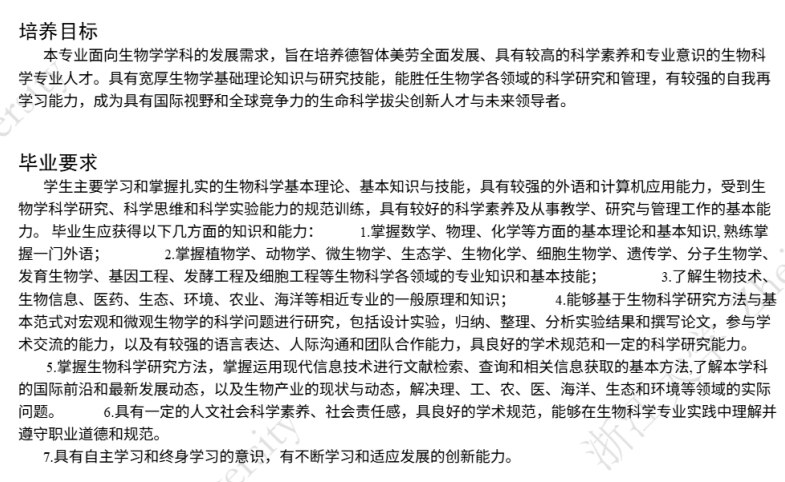
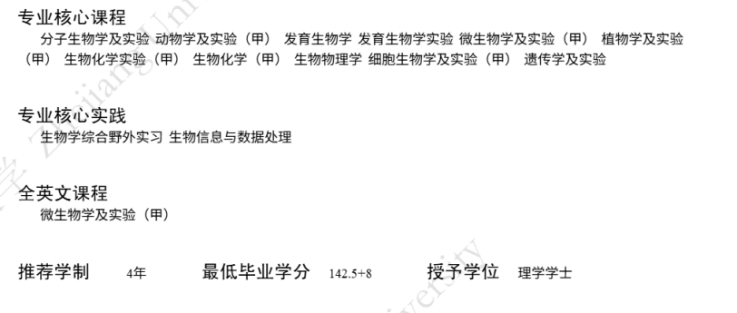
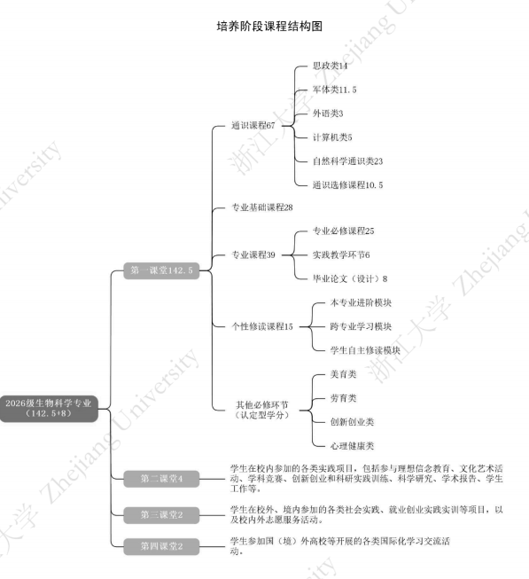
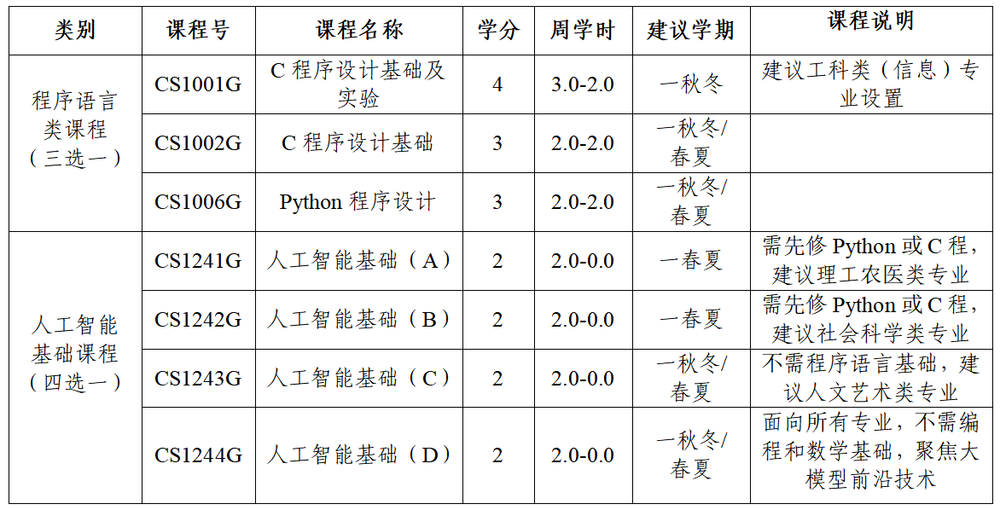
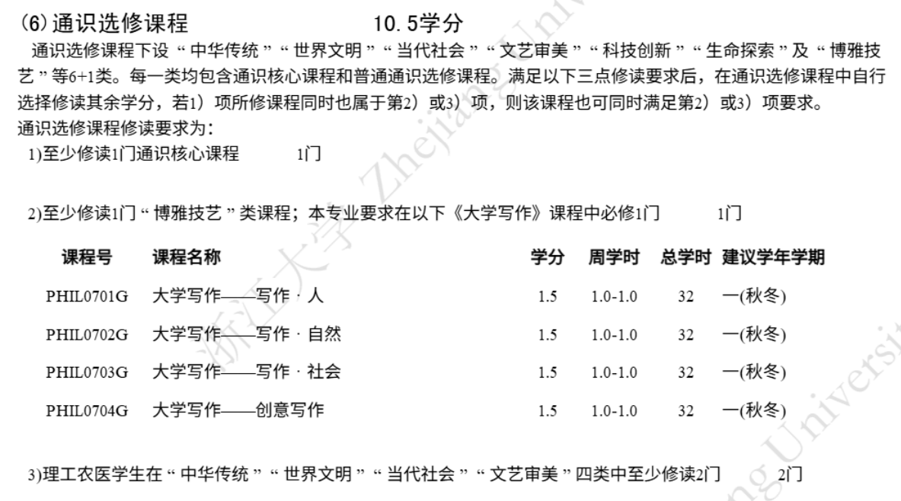

# 培养方案
<!-- 2026 TODO -->

培养方案涵盖了相关专业的培养目标、毕业要求、毕业学分、学制、学位、主干课程、修读课程等众多重要信息，是学生专业分流时进行选择的重要参考，也是相关专业学生选课的重要依据。

培养方案在开学初会以PDF文件形式发送给学生， 学生亦可在浙大钉APP、浙江大学本科教学管理信息服务平台、[浙江大学本科生院办公网](https://zjuers.com/rd?url=https://bksy.zju.edu.cn/28309/list.htm&mode=1)等网站上自行搜索查阅。

目前，浙大钉APP及教务系统暂未更新2026级培养方案，下文示例参考[关于做好2026级本科专业培养方案调整工作的通知](https://bksy.zju.edu.cn/2026/0521/c28324a3165132/page.htm)和生命科学学院提交的2026级培养方案初稿，具体培养方案会在开学后公示。

> 竺可桢学院中混合班、人文社科实验班、巴德年医学班的培养方案为个性化培养方案，由于实际实施中是一人一策，这里不展开介绍，相关同学可向竺可桢学院教学科或学长组了解。

## 导引信息

### 目标与要求

浙江大学对于每一专业均会制定相应的培养目标和毕业要求，如后页图所示。该目标和要求是学生学习成长的参考，但并非硬性指标。

  
### 核心课程、毕业学分、学制学位

### 专业核心课程

专业核心课程是该专业最核心、最重要、最关键，但也往往是内容最多、难度最大的课程，同时也是每一位选择该专业的学生必须掌握的课程（部分学院保研会有加权）。

### 专业核心实践

专业核心实践同专业主干课程类似，不过主要以实践为主。

### 全英文课程

课如其名，是全英文讲解的课程。

### 推荐学制

即在正常情况下（不提前亦不延期毕业），该本科专业应当修读的年限。绝大部分专业为4年，医学院部分专业、建筑学和动物医学专业为5年。本科阶段学制最多可延长2年。

### 最低毕业学分（参考上图）

即在满足各项课程修读要求前提下，毕业需要修读的最低学分数。其中：

- 142.5学分：第一课堂所有课程，包括正常理论和实践课程等需要修读的学分；
- +8学分：第二课堂（+4）、第三课堂（+2）和第四课堂（+2）学分，可通过参加相关活动进行申请和认定，见本指引的[“学习-基本概念”](./concepts.md/#_5)部分。

### 授予学位

本科毕业授予的学位均为“学士”，依据学科不同，分为：哲学、经济学、法学、教育学、文学、历史学、理学、工学、农学、医学、管理学、艺术学、建筑学。

### 学科专业类别与支撑学科

该专业所属的学科类别和对应的一级学科。

## 培养阶段课程结构图

## 课程设置与学分分布

### 课程类别

依据课程内容不同，可划分为通识类课程、专业基础课、专业课程、个性修读课程、其他必修环节和第二、三、四课堂等。依据课程修读要求不同，可分为必修课程和选修课程，在培养方案中设置若干级标题进行分类，每级标题右侧都有该标题下涵盖课程的学分修读要求。

### 课程信息

1. 课程号：即课程的代码，是该门课程的“身份标记”；
> 部分课程可能中途遇上课程改革，课程号有变更，在选课系统（见本指引的[“选课”](../course_sys/enroll.md)部分）中课程名称一致，但课程号不同，请小心注意。
2. 课程名称：无需解释；
3. 学分：见本指引的[“学习-基本概念”](./concepts.md/#_11)部分；
4. 周学时：即“课时”，其中4.0-2.0表示每周理论课课时为4课时，实践课课时为2课时；
5. 建议学年学期：即建议该专业学生在某学年某学期修读该课程，最好按照培养方案中建议学年学期来进行课程的修读，否则可能出现较多问题，如部分专业课需要预先修读其他课程，未修读可能导致课程进展困难。
   
**2024年春季开始课程号由统一编码代替，其规则如下：**

- 前2-4个字节为英文字母，代表开课学院
- 之后四个数字，第一个数字代表课程层次，0为通识选修和体育课，1-5为本科建议修读年份，6为硕士，7为博士，9为硕博通用课
- 之后三个数字为课程顺序号
- 之后一个英文字母代表课程类别
- 最后有两个非必选项，英文字母为特殊标记，数字则为更新标记。

示例：

- 微积分（甲）I课程号为MATH1135G。MATH代表数学学院，第一个“1”代表建议第一学年修读，135为顺序号，G代表通识课。
- 泛函分析（甲）课程号为MATH3182MZ。3代表第三学年修读，M代表专业课，Z代表荣誉课程。
- 大学化学实验（O）课程号为CHEM1007F。CHEM为化学系，F代表实验课。

### 通识类课程

通识类课程通常分为三类：

- 第一类为几乎所有大学生均必须修读的固定课程，如思政类、军体类、外语类；
- 第二类为该专业涉及的底层基础学科课程，如计算机类、自然科学通识类；
- 第三类为学生需要自主选择修读的非专业性课程，主要为通识选修课。

大部分通识课程将在大一学年修读完成，少部分留待大二、大三学年修读。

#### 思政类课程 14学分

除港澳台生和留学生外，其余学生必须修读思政类课程，港澳台生及留学生需要用其他课程来置换该部分学分。思政类课程往往会直接预置（见本指引的[“选课”](../course_sys/enroll.md)部分），包括：

1. 习近平新时代中国特色社会主义思想概论；
2. 大学生思想文化素养（26级新开设）；
3. 新时代实践教育（短学期，26级新开设）；
4. 马克思主义基本原理（马原）；
5. 中国共产党历史与理论（26级新开设）；
6. 思政选修类课程：四史，包括中国改革开放史、新中国史、中国共产党历史、社会主义发展史，四选一修读。（由于学分改变，具体情况按培养方案最终版确定）

#### 军体类课程 11.5学分

包括军事类和体育类课程：

1. 军训：见本指引的[”军训“](../military_training/time.md)部分；
2. 国家安全教育（26级新开设）；
2. 军事理论：与军事相关的理论知识教育和国防安全教育，通常会预置；
3. 体育课：2026级学生须修读6学期体育课（体育I~体育VI），自主选课；
4. 体测与锻炼：各学年体质健康测试达标后可获得学分；

#### 外语类 3-6学分

##### 外语课程

外语类课程实行阶梯式学分修读要求，根据学生英语能力由低到高划分为L1、L2、L3三个层次，最高6学分，实施方案见《外语类通识课程修读方法》，由学校统一设置（新政策）。

26级前，具体需核实：修读完大英三后可继续修读大英四，如果先修读的是大英四，修读完大英四后可以修读大英三。此外，也可以选择小语种课程。

> 外语类课程往往抢课困难，请谨慎退课。此外，涉及校区搬迁，尤其是需要搬迁至舟山校区的海洋学院学生，建议在大一、大二两学年内修满外语学分，否则跨校区修读极为不便。

#### 计算机类 2-5学分

与计算机及编程相关的课程，几乎每个专业都会有，但课程类别与要求不同

#### 自然科学通识类

基础的自然科学学科课程，即“数理化生”等基础课及其配套实验课，如微积分、大学物理、有机化学等，各专业要求不同，但对大多数学生均十分重要，内容多、难度大。部分课程分若干学期开课，课程名称将按I、II、III进行标号。部分课程设置不同难度梯度，甲＞乙＞丙。

不同层次课程修读和替换可以参考[浙江大学本科课程层次关系一览表 (2025级起)](https://zdbk.zju.edu.cn/jwglxt/xtgl/xwgl_ckXw.html?xwbh=446608874C259D66E0632AB3CA0A64FE&doType=save)和[浙江大学竺可桢学院本科课程层次关系一览表](https://zdbk.zju.edu.cn/jwglxt/xtgl/xwgl_ckXw.html?xwbh=44663AFDD367E0BAE0632AB3CA0AAAE8&doType=save)

#### 通识选修课程

学生可自主选择修读，要求至少修读10.5学分，且溢出学分中最多2学分可作为个性课程学分（见后文）。

> 关于上图中“1）”的表述，通识核心课程在“课程类别”有标识。关于上图中“3）”的表述，指修读“两门”而非“两类各一门”，因此学生可在规定的同一类别中（如中华传统）选择两门课程修读。个别专业会放一些必修的通识选修，按照培养方案修读即可。

### 专业基础课

专业基础课程是与该专业领域相关的重要课程，通常含有部分专业主干课程。相较于自然科学通识类课程，专业基础课程与专业联系更加紧密，已经接触到涉及学科本身的基础知识。但与专业课程相比，专业基础课涉及面较广，是各具体专业方向的基础。

### 专业课程

#### 专业必修课程

专业必修课则是学习专业的具体的、重要的知识的课程，相对专业基础课更为的具体与深入。

#### 实践教学环节

实践教学环节一般开设在小学期（夏学期以后）。在选课时，小学期课程在其之前的夏学期进行选课，而学分和绩点计入其后的秋冬学期。

#### 毕业论文（设计）

顾名思义，为毕业论文（设计）开设的课程，不过仅供选课获得对应学分，具体安排由学院决定。

### 个性修读课程

按照修读的课程属性，个性修读课程可分为：本专业进阶模块、跨专业学习模块与学生自主修读模块。可自主选择其中一种修读。

#### 本专业进阶模块

专业进阶模块中的课程一般为专业的进阶课程，可供学生进一步深入本专业的知识，有些课程也会涉及本专业的前沿领域。

#### 跨专业学习模块

微辅修+补够学分
> 学生可修读其他院系开设的微辅修项目，修读完成后，可获得微辅修证书。若修读的微辅修项目要求学分不足15学分，不足部分可用本专业“专业基础课程”“专业课程”或“本专业进阶模块”中的课程补足。

#### 学生自主修读模块 

自主修读模块让学生根据自己的学业规划、职业规划，自主选择修读感兴趣的课程。

> 包含本科课程、研究生课程或经认定的境内、外交流的课程。

- 通识选修类特别说明

其中，“通识选修类课程”最多只能溢出2学分作为自主修读学分。若本人专业课（如专业选修课）存在学分溢出的情况，亦可作为自主修读学分，且“溢出”学分是可以拆分的。

> 如：一门5学分专业选修课，若有溢出，可将2学分作为专业选修课学分，3学分作为个性学分。同时，至少要求修读一门不在本专业培养方案中的课程。

- 其他特殊要求

如选择自主修读模块，一般会要**求至少修读一门跨专业课程**，目前对跨专业课程的认定要求必须是跨学院（系）修读“专业基础课程”或“专业课程”，且不在培养方案内。

> 如：经济学院下设经济、金融、财政、国贸四个专业，经济学修读金融学的专业课，不能认定为跨专业修读，但可以认定为自主修读（如果这门课培养方案上没有的话）。

### 其他必修环节

> 以下均为认定型学分，即若修读的某一门课程满足上述的课程要求，则除获得该课程原本的学分以外，自动认定获得上述类型课程的学分（该学分不计绩点，原课程学分计绩点）。同时，除劳育外，均为学分要求。

#### 创新创业类 2学分

与创新创业和学生职业生涯规划引导相关的课程，按本科生院公布的创新创业类课程清单修读。

#### 心理健康类课程 2学分

按本科生院公布的心理健康类课程清单修读。

#### 美育类 2学分

按本科生院公布的美育类课程清单修读。

> 可修读通识选修课程中的“文艺审美”类课程、“博雅技艺”类中艺术类课程、艺术类专业课程。

> 美育课程往往非常难选上，建议尽早选课。

#### 劳育类 32学时

按本科生院公布的劳育类课程清单修读。

> 可修读学校设置的公共劳动平台课程或院系开设的专业实践劳动课程。

### 二三四课堂

已在本指引的[“学习-基本概念”](./concepts.md/#_5)部分提及。

## 培养方案修读指导性计划

学院按培养方案提供的指导性计划，比较清楚的列出了需要修读的课程以及对应的修读时间，可以参考进行选课以及参加对应的活动。但注意其中并没有包含通识课、创新创业课等的计划，需要自行安排。

## 辅修

详见本指引的[“学习-辅修”](./minor.md)一节。

## 育人目标总图

展示整个课程核心体系。
